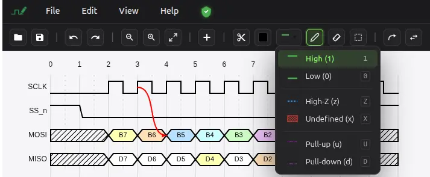

# WavePaint

Digital Timing Diagram GUI Editor

## About This Repository

This is an **open source** repository for community-contributed materials, examples, and issue tracking related to [WavePaint](https://www.wavepaint.net/).

### Important Note

 **The web application code of WavePaint (https://www.wavepaint.net/) is not open source.** This repository is specifically for:

- 📚 Open source examples and tutorials
- 🐛 Issue tracking and feature requests
- 💡 Community contributions and discussions
- 📖 Documentation and guides

The actual WavePaint web application remains proprietary software.

## What is WavePaint? 

WavePaint is a digital timing diagram GUI editor available at https://www.wavepaint.net/. It helps users create professional timing diagrams for digital circuits and systems.

## Repository Structure

This repository is organized to support the WavePaint community:

- `/examples` - Example timing diagrams and use cases (coming soon)
- `/docs` - User guides and documentation (coming soon)
- `/issues` - Track bugs and feature requests via GitHub Issues

## Contributing

We welcome community contributions! You can:

- Submit example timing diagrams
- Report bugs or request features via GitHub Issues
- Contribute documentation and tutorials
- Share your WavePaint workflows and tips

## License

The content in this repository (examples, documentation, etc.) is open source and available under the MIT License. However, this does NOT include the WavePaint web application itself, which is proprietary software.

## Links

- 🌐 WavePaint Web Application: https://www.wavepaint.net/
- 🐛 Issue Tracker: https://github.com/lodigic/WavePaint/issues
